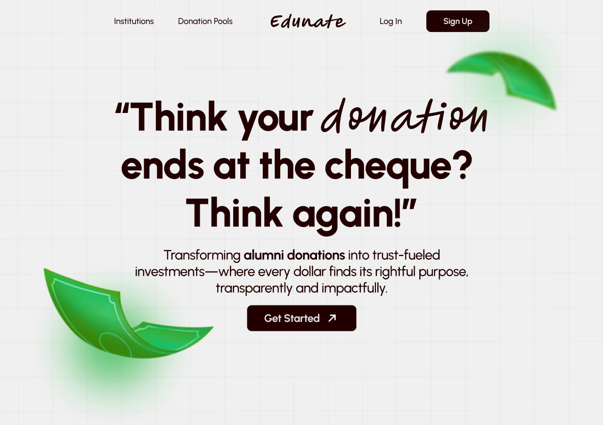

# Edunate - An EduFI Alumni Donation Platform



Edunate is an EduFI platform designed to streamline the donation process for educational institutions. By leveraging blockchain technology and robust AI/ML techniques, Edunate ensures transparency, traceability, and accountability for every donation made. The platform empowers alumni to contribute to educational institutions in a secure and efficient manner, while ensuring that their donations are utilized effectively.

## Features


### 1. **Blockchain Integration**

- **Secure Donations:** Alumni can donate to educational institutions via blockchain, ensuring that all transactions are secure, transparent, and traceable.
- **Smart Contracts:** Donations are managed through smart contracts, which automate processes like milestone-based payment releases and ensure that funds are used according to the agreed terms.
- **Milestone-based Payments:** Fundraisers are broken into milestones, and payments are released only when predefined conditions are met (e.g., institution verification, student votes).
- **Transaction Transparency:** All transactions are recorded on the blockchain, enabling donors and institutions to track donations in real-time, offering complete transparency.

### 2. **Institution-Specific Fundraising Pools**

- **Custom Donation Pools:** Institutions can create specific donation pools for different purposes, such as scholarships, infrastructure development, or research funding.
- **Targeted Fundraising:** Donors can choose specific projects or goals to support, ensuring their contributions directly impact the areas that matter to them.
- **AI/ML based auto pool generation:** Our AI/ML model generates the pool based on the student's reviews and the institution's needs.

### 3. **Alumni Interaction & Voting**

- **Student Voting:** Students can vote for specific projects, allowing the alumni to see the projects with the most support.
- **Scholarship Applications:** Students can apply for scholarships, enabling direct donations from alumni based on specific needs.

### 4. **Milestone Tracking**

- **Track Progress:** Our handcrafted AI/ML(Transformer and GANs) can create milestones for each fundraising campaign, and donors can see how their contributions are making a difference in reaching the goal.
- **Conditional Releases:** Payments are only released when milestones are reached and verified by both the institution and the students.

### 5. **Transparent Fund Utilization**

- **Invoice Verification:** Institutions can upload invoices for projects funded by donations. These invoices are passed through ML pipleine (Swin Transformer + VAE(Variational Auto Encoder)) to verify the authenticity of the invoices.

### 6. **Edunate Token (EDU)**

- **Transaction Fee Reduction:** The platform uses a native token (EDU) for transaction processing and to reduce blockchain gas fees.
- **Token-Based Voting:** Alumni can use the EDU token to vote on institutional projects, ensuring that they have a direct say in how donations are spent.

### 7. **Security and Privacy**

- **Encrypted Data Storage:** User data and donation details are securely encrypted, ensuring privacy for both donors and institutions.
- **Permissioned Blockchain:** A permissioned blockchain ensures that only authorized users can interact with the system, adding an extra layer of security.

### 8. **User Dashboard**

- **Donation History:** Donors can view their donation history, track the impact of their contributions, and monitor the status of ongoing projects.
- **Fundraiser Creation:** Institutions can easily create and manage fundraising campaigns, track milestones, and release payments through the platform.

---

## How It Works


1. **Alumni Donation**: Alumni connect their MetaMask wallet to the platform and choose a fundraiser they wish to support.
2. **Donation Process**: Alumni can donate in ETH or EDU tokens, and the donation is logged on the blockchain for transparency.
3. **Fundraiser Creation**: Institutions create fundraisers with specific goals, deadlines, and milestone-based payment structures.
4. **Milestone Achievement**: Payments are made only when milestones are verified through the voting system, ensuring that funds are used efficiently.
5. **Secure Verification**: Each project or scholarship is verified through uploaded invoices, ensuring that donations are used as intended.

---

## Why Edunate?

- **Transparency**: Donors can see exactly how their funds are being used, with every transaction recorded on the blockchain.
- **Accountability**: Milestone-based payments ensure that donations are spent according to the goals set by the institution.
- **Efficiency**: The use of smart contracts automates fundraising processes, reducing manual overhead and ensuring faster processing times.
- **Impact**: Students have a say in which projects are funded, ensuring that their needs are addressed directly.

---

## Future Plans

- **Global Expansion**: Edunate plans to expand its platform to more institutions and regions, enabling more alumni to contribute to the growth of educational institutions worldwide.
- **More robust AI/Ml models**: We plan to integrate more robust AI/ML models to predict the success of the projects and the impact of the donations.

---

## Installation (For Developers)

To set up the project locally, follow these steps:

Clone the repository and start the frontend/backend:

```
git clone https://github.com/HitG010/Edunate
npm install
```

In a new terminal shell,

```
cd edunate-backend
npm install
nodemon server.js
```

For the setup of blockchain :

```
cd ./Smart Contract/
npm i
npx hardhat node
```

In another instance of bash

```
cd ./Smart Contract/
npx hardhat run scripts/deploy.js --network localhost
```

For Python AI/ML Setup

```
pip install -r requirements.txt
cd models
python3 pool-generator/app.py
```


